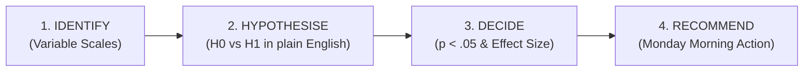
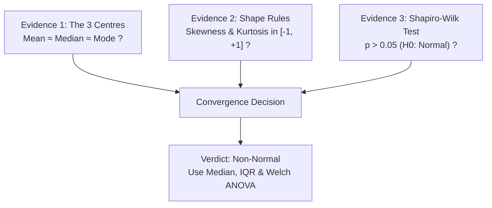

# S&P 500 Quantitative Data Analysis — Step-by-Step Methodology Guide

## Complete Mathematical, Econometric & Operational Walkthrough (Sessions 1 to 4)

> **Course**: Quantitative Data Analysis (M1 – S7, Course Code: `2627_ECO_2_EN_009`)
> **Institution**: EM Normandie Business School · Programme Grande École
> **Lecturer**: Dr. NGUYEN Anh-Tuan
> **Target Audience**: Consulting Team, Academic Evaluators, and Peer Group Members
> **Dataset**: $N = 503$ S&P 500 Corporations (Audited FY2025 Financials & ISS Governance Scores)
> **Software**: Python (Data Science Engine) & Jamovi (Open-Source Point-and-Click Lab Environment)

---

## Table of Contents

1. [Introduction: Pedagogical Objectives & Research Problematic](#1-introduction-pedagogical-objectives--research-problematic)
2. [Phase 1: Data Acquisition, Provenance & Architecture](#2-phase-1-data-acquisition-provenance--architecture)
3. [Phase 2: Data Cleaning, Audit & Anomaly Remediation](#3-phase-2-data-cleaning-audit--anomaly-remediation)
4. [Phase 3: Session 1 — Univariate Analysis & Normality Diagnostics](#4-phase-3-session-1--univariate-analysis--normality-diagnostics)
5. [Phase 4: Session 2 — Bivariate Analysis: Categorical & Continuous Associations](#5-phase-4-session-2--bivariate-analysis-categorical--continuous-associations)
6. [Phase 5: Session 3 — Group Comparisons: Welch's ANOVA & Games-Howell](#6-phase-5-session-3--group-comparisons-welchs-anova--games-howell)
7. [Phase 6: Session 4 — Multiple Linear Regression & Econometric Modeling](#7-phase-6-session-4--multiple-linear-regression--econometric-modeling)
8. [Phase 7: Jamovi Software Step-by-Step Execution Manual](#8-phase-7-jamovi-software-step-by-step-execution-manual)
9. [Conclusion: The Executive Synthesis & Defense Strategy](#9-conclusion-the-executive-synthesis--defense-strategy)

---

## 1. Introduction: Pedagogical Objectives & Research Problematic

### 1.1 The Core Research Question (The "Problematic")

In corporate management and institutional investment, a major strategic dilemma persists:

$$\text{Does dedicated corporate governance compliance compromise financial profitability, or does it confer a resilience and performance premium?}$$

- **The Traditional Shareholder Theory View (Milton Friedman, 1970)**: Governance compliance, board diversity committees, independent audit mandates, and compensation oversight generate bureaucratic friction and operational costs that drag down bottom-line profit margins.
- **The Modern Stakeholder / Agency View (Jensen & Meckling, 1976)**: Poor corporate governance fosters agency conflicts, manager-shareholder misalignment, excessive executive compensation, and heightened systematic market risk ($\beta$). Strong governance reduces risk and improves capital allocation efficiency.

### 1.2 The Course 4-Step Answering Protocol (Slide 9 & 41)

In quantitative data analysis, calculating a test statistic without structured business interpretation earns zero credit. Every single statistical question in this project strictly follows this 4-step sequence:

1. **IDENTIFY**: Which statistical test to execute? Justified solely from the scale types of the variables involved (Nominal, Ordinal, Continuous).
2. **HYPOTHESISE**: Formulate the Null ($H_0$) and Alternative ($H_1$) hypotheses in plain business language.
3. **DECIDE**: Is the test statistically significant ($p < 0.05$)? What is the practical strength/magnitude of the effect size?
4. **RECOMMEND**: Actionable operational advice answering: _"What does the portfolio manager or corporate executive do on Monday morning?"_

---

## 2. Phase 1: Data Acquisition, Provenance & Architecture

### 2.1 The 6 Non-Negotiable Course Constraints (AQD Session 1, Slide 29)

Every dataset submitted for this course must satisfy six strict rules:

| Criterion # | Rule Description         | Dataset Implementation                                 |                       Verification                       |
| :---------: | ------------------------ | ------------------------------------------------------ | :------------------------------------------------------: |
|    **1**    | **Unit of Observation**  | 1 row = 1 firm (Zero duplicates across rows)           |            Passed (`Ticker.is_unique = True`)            |
|    **2**    | **Sample Size**          | $N \ge 100$ valid corporate entities                   |                 Passed ($N = 503$ firms)                 |
|    **3**    | **Nominal Variable**     | Exactly **2 to 5** categories (Grouping factor)        |        Passed (`Sector` = 5 consolidated groups)         |
|    **4**    | **Ordinal Variable**     | At least 1 ranked categorical variable                 | Passed (`Governance_Risk_Level` & `Market_Cap_Quartile`) |
|    **5**    | **Continuous Variables** | At least 3 ratio/interval scale numeric variables      |         Passed (9 continuous metrics available)          |
|    **6**    | **Jamovi Header Format** | Short headers, no spaces, no accents, no special chars |             Passed (`sp500_esg_jamovi.csv`)              |

### 2.2 Data Provenance & Why Full Fiscal Year 2025 (FY2025)?

- **Universe**: 503 constituent firms of the S&P 500 equity index, dynamically scraped from the official Wikipedia constituent directory.
- **Corporate Governance Quality**: Extracted from **Institutional Shareholder Services (ISS)** Governance QualityScore.
- **Financial Statements**: Extracted via `yfinance` querying official SEC Form 10-K audited regulatory filings for the completed **Fiscal Year 2025 (FY2025)**.
- **Why FY2025 instead of 2026?** Partial 2026 data suffers from seasonal distortion, un-audited quarterly noise, and incomplete reporting. Using full FY2025 guarantees 12 months of audited operational performance for every firm.

---

## 3. Phase 2: Data Cleaning, Audit & Anomaly Remediation

Real-world financial data is never clean. Students who fail to clean data make erroneous conclusions. Our pipeline executes 6 programmatic cleaning steps:

### Step 1: Ticker Rebranding Remediation (Fiserv `FISV` $\rightarrow$ `FI`)

- **Issue**: In the raw extract, row 199 (`FISV`) was full of missing values.
- **Cause**: Fiserv transferred its listing from NASDAQ to the NYSE in 2023 and changed its ticker to `FI`.
- **Solution**: Script programmatically remaps `FISV` to `FI`, restoring sector (_Finance_), FY2025 revenue (\$19.09B), profit margin ($16.0\%$), and ISS scores.

### Step 2: Negative Book Equity & Undefined ROE ($N = 32$ Firms)

- **Issue**: 32 premier corporations (AbbVie, Altria, AutoZone, Booking Holdings, Domino's Pizza, etc.) have `NaN` for Return on Equity (`ROE`).
- **Financial Theory**:
  $$\text{ROE} = \frac{\text{Net Income}}{\text{Shareholders' Equity}}$$
  These mature corporations engaged in aggressive, debt-funded share buybacks for over a decade. Cumulative buybacks exceeded retained earnings, pushing accounting book equity below zero. Because net income divided by negative equity is mathematically meaningless, financial databases suppress ROE.
- **Remediation**: Deleting these 32 firms would introduce catastrophic survival and industry bias. We document this phenomenon and introduce **Net Profit Margin** ($\frac{\text{Net Income}}{\text{Revenue}}$) as our universal profitability metric, available for all $N = 503$ firms.

### Step 3: Extreme Outlier Treatment (Masco Corp `MAS`)

- **Issue**: Masco Corp showed an ROE of $5,862.5\%$.
- **Cause**: Tiny book equity balance ($\approx \$80\text{M}$) against $\$1\text{B}$ in profits.
- **Remediation**: In accordance with course guidelines (Slide 21), we do **not** winsorize or delete authentic data. We report both the mean ($\bar{x} = 39.5\%$) and median ($\text{Mdn} = 16.8\%$) and use the median as the true managerial measure of central tendency.

### Step 4: Sector Consolidation (11 GICS $\rightarrow$ 5 Groups)

The Global Industry Classification Standard has 11 sectors. To satisfy Criterion 3 (2 to 5 groups), sectors are mapped into:

1. **Tech & Comms** ($n = 99$, $19.7\%$)
2. **Healthcare** ($n = 63$, $12.5\%$)
3. **Finance** ($n = 74$, $14.7\%$)
4. **Industrials & Energy** ($n = 143$, $28.4\%$, Mode)
5. **Consumer** ($n = 124$, $24.7\%$)

### Step 5: Ordinal Variable Engineering

1. **`Market_Cap_Quartile`**: Q1 (Smallest: $\$6.5\text{B}–\$22.2\text{B}$), Q2 ($\$22.2\text{B}–\$44.5\text{B}$), Q3 ($\$44.5\text{B}–\$94.0\text{B}$), Q4 (Mega-Cap: $\$94.0\text{B}–\$5,367.1\text{B}$).
2. **`Governance_Risk_Level`**: Low (1–3), Medium (4–6), High (7–10).

---

## 4. Phase 3: Session 1 — Univariate Analysis & Normality Diagnostics

### 4.1 Continuous Descriptive Metrics & The Three Centres

For any continuous variable $X$ with valid sample size $n$:

$$\text{Mean: } \bar{x} = \frac{1}{n} \sum_{i=1}^n x_i \quad | \quad \text{Variance: } s^2 = \frac{\sum_{i=1}^n (x_i - \bar{x})^2}{n - 1} \quad | \quad \text{Std Dev: } s = \sqrt{s^2}$$

$$\text{Interquartile Range: } IQR = Q_3 - Q_1 \quad | \quad \text{Mode: Most frequent rounded value}$$

### 4.2 Distribution Shape Parameters

$$\text{Skewness } (g_1) = \frac{n}{(n-1)(n-2)} \sum_{i=1}^n \left(\frac{x_i - \bar{x}}{s}\right)^3$$

$$\text{Fisher Excess Kurtosis } (g_2) = \frac{n(n+1)}{(n-1)(n-2)(n-3)} \sum_{i=1}^n \left(\frac{x_i - \bar{x}}{s}\right)^4 - \frac{3(n-1)^2}{(n-2)(n-3)}$$

### 4.3 Normality Evaluation Protocol: Three Converging Evidences (Slide 24)

Never conclude on normality with a single test. Evaluate all three simultaneously:

#### Application to Net Profit Margin (`Profit_Margin`):

1. **Centres Divergence**:
   - $\text{Mean} = 0.1479$ ($14.79\%$)
   - $\text{Median} = 0.1315$ ($13.15\%$)
   - $\text{Mode} = 0.0800$ ($8.00\%$)
   - Significant divergence ($\text{Mean} > \text{Median} > \text{Mode}$).
2. **Shape Violation**:
   - $\text{Skewness} = -3.23$ (Severely violates $[-1.0, +1.0]$, long left tail of distressed firms).
   - $\text{Kurtosis} = +28.91$ (Extreme leptokurtic peakedness, heavy fat tails).
3. **Formal Shapiro-Wilk Test**:
   - Statistic: $W = 0.6530, N = 503$
   - $p\text{-value} < .001$
   - **Crucial Inverted Logic (Slide 24)**: Because $p < 0.05$, we **REJECT the null hypothesis of normality**!
   - **Managerial Conclusion**: Net Profit Margin is non-normal. Parametric standard ANOVA is invalid; robust Welch ANOVA and non-parametric tests are mandatory.

---

## 5. Phase 4: Session 2 — Bivariate Analysis: Categorical & Continuous Associations

### 5.1 Categorical Association: Chi-Square ($\chi^2$) Test of Independence

- **Variables**: `Sector` (Nominal, 5 groups) $\times$ `Governance_Risk_Level` (Ordinal, 3 tiers).
- **Hypotheses**:
  - $H_0$: Corporate governance risk tier is independent of business sector.
  - $H_1$: Corporate governance risk tier is significantly associated with business sector.

#### Mathematical Steps:

1. **Expected Frequencies**:
   $$E_{ij} = \frac{\text{Row Total}_i \times \text{Column Total}_j}{N}$$
2. **Chi-Square Statistic**:
   $$\chi^2 = \sum_{i=1}^5 \sum_{j=1}^3 \frac{(O_{ij} - E_{ij})^2}{E_{ij}} = 14.719$$
3. **Degrees of Freedom**:
   $$df = (r - 1)(c - 1) = (5 - 1)(3 - 1) = 4 \times 2 = 8$$
4. **$p$-value & Decision**:
   $$p = .0648 \quad (p > 0.05)$$
   At the standard $\alpha = 0.05$ threshold, we fail to reject $H_0$ globally. However, it is marginally significant ($p < 0.10$).
5. **Effect Size: Cramér's $V$**:
   $$V = \sqrt{\frac{\chi^2}{N \times \min(r - 1, c - 1)}} = \sqrt{\frac{14.719}{496 \times 2}} = \sqrt{0.01484} = 0.1218 \approx 0.122$$
   Indicates a weak-to-moderate association.
6. **Standardized Residuals**:
   $$\text{Residual} = \frac{O - E}{\sqrt{E}}$$
   - _Tech & Comms $\times$ High Risk_: $\text{Residual} = +1.75$ ($50.5\%$ High Risk vs expected $39.7\%$).
   - _Industrials & Energy $\times$ High Risk_: $\text{Residual} = -1.97$ (Significantly under-represented in High Risk, exceptional compliance).

### 5.2 Continuous Association: Pearson $r$ & Fisher $z$ 95% Confidence Interval

- **Variables**: `Overall_Governance_Risk` (Continuous, 1–10) vs `Beta` (Systematic Risk).
- **Formula**:
  $$r = \frac{\sum (x_i - \bar{x})(y_i - \bar{y})}{\sqrt{\sum (x_i - \bar{x})^2 \sum (y_i - \bar{y})^2}} = +0.2677$$
- **Significance**:
  $$t = r \sqrt{\frac{n - 2}{1 - r^2}} = 0.2677 \sqrt{\frac{490}{1 - 0.07166}} = 6.15 \implies p < .001^{***}$$
- **Fisher $z$-Transformation & 95% Confidence Interval**:
  $$z = \frac{1}{2} \ln \left(\frac{1 + 0.2677}{1 - 0.2677}\right) = 0.2744 \quad | \quad SE_z = \frac{1}{\sqrt{n - 3}} = \frac{1}{\sqrt{489}} = 0.0452$$
  $$z_{\text{low}} = 0.2744 - 1.96(0.0452) = 0.1858 \implies r_{\text{low}} = \tanh(0.1858) = +0.183$$
  $$z_{\text{high}} = 0.2744 + 1.96(0.0452) = 0.3630 \implies r_{\text{high}} = \tanh(0.3630) = +0.348$$
  $$\text{95% CI: } [+0.183, +0.348]$$
- **Managerial Verdict**: Weak governance (higher ISS risk score) significantly inflates systematic market risk ($\beta$). The relationship is positive, moderately strong, and statistically robust.

---

## 6. Phase 5: Session 3 — Group Comparisons: Welch's ANOVA & Games-Howell

### 6.1 The Homogeneity of Variances Test (Levene's Test)

Before running ANOVA, we test the assumption of equal variances:

- $H_0: \sigma_1^2 = \sigma_2^2 = \dots = \sigma_5^2$
- **Result**: $F = 5.394, p < .001^{***}$
- **Decision**: Reject $H_0$. Group variances are severely unequal (**heteroscedasticity**). Standard Fisher's ANOVA is invalid. We must report **Welch's Robust ANOVA**.

### 6.2 Welch's Robust ANOVA ($F_{\text{Welch}}$)

Weighting each group by its sample variance ($w_i = n_i / s_i^2$):

$$w_i = \frac{n_i}{s_i^2}, \quad W = \sum w_i, \quad \bar{x}' = \sum \frac{w_i \bar{x}_i}{W}$$

$$F_{\text{Welch}} = \frac{\frac{1}{k - 1} \sum w_i (\bar{x}_i - \bar{x}')^2}{1 + \frac{2(k - 2)}{k^2 - 1} \sum \frac{(1 - w_i/W)^2}{n_i - 1}} = 9.302$$

- Degrees of Freedom: $df_1 = 4$, $df_2 = 191.21$
- $p\text{-value} < .001^{***}$
- **Effect Size (Eta-Squared)**:
  $$\eta^2 = \frac{SS_{\text{between}}}{SS_{\text{total}}} = \frac{1.748}{43.149} = 0.0405 \quad (4.05\% \text{ of margin variance is explained by sector})$$

### 6.3 Post-Hoc Pairwise Comparisons: Games-Howell

Because Levene's test failed, Tukey's HSD cannot be trusted. We run the **Games-Howell post-hoc test**:

$$t = \frac{\bar{x}_i - \bar{x}_j}{\sqrt{\frac{s_i^2}{n_i} + \frac{s_j^2}{n_j}}}, \quad df = \frac{\left(\frac{s_i^2}{n_i} + \frac{s_j^2}{n_j}\right)^2}{\frac{(s_i^2/n_i)^2}{n_i - 1} + \frac{(s_j^2/n_j)^2}{n_j - 1}}$$

#### Key Empirical Pairwise Results:

1. **Finance vs. Healthcare**: Mean difference $= +0.1311$ ($+13.1\%$), $t = 4.38$, $p < .001^{***}$
2. **Finance vs. Consumer**: Mean difference $= +0.0913$ ($+9.1\%$), $t = 4.09$, $p < .001^{***}$
3. **Finance vs. Industrials**: Mean difference $= +0.0934$ ($+9.3\%$), $t = 4.34$, $p < .001^{***}$

- **Takeaway**: The Financial sector achieves significantly higher profit margins than all non-tech sectors.

---

## 7. Phase 6: Session 4 — Multiple Linear Regression & Econometric Modeling

### 7.1 Three-Stage Model Progression

$$\text{Model 1: } \text{Margin} = \beta_0 + \beta_1 \text{Gov\_Risk} + \epsilon$$

$$\text{Model 2: } \text{Margin} = \beta_0 + \beta_1 \text{Gov\_Risk} + \beta_2 \ln(\text{Cap}) + \beta_3 \ln(\text{Rev}) + \beta_4 \text{Beta} + \epsilon$$

$$\text{Model 3: } \text{Margin} = \beta_0 + \beta_1 \text{Gov\_Risk} + \text{Scale Controls} + \sum_{j=1}^4 \gamma_j \text{Sector\_Dummy}_j + \epsilon$$

### 7.2 Model Estimation Results Table

| Parameter / Metric              |    Model 1 (Simple)    |      Model 2 (Controls)      |  Model 3 (Sector Fixed Effects)  |
| ------------------------------- | :--------------------: | :--------------------------: | :------------------------------: |
| **Intercept ($\beta_0$)**       |     $0.1652^{***}$     |          $-0.0984$           |            $-0.1084$             |
| **Governance Risk ($\beta_1$)** | $-0.0039$ ($p = .304$) |    $-0.0051$ ($p = .172$)    |  **$-0.0059^{*}$ ($p = .037$)**  |
| **Log Market Cap**              |           —            | $+0.0468^{***}$ ($p < .001$) |   $+0.0494^{***}$ ($p < .001$)   |
| **Log Revenue**                 |           —            | $-0.0347^{***}$ ($p < .001$) |   $-0.0371^{***}$ ($p < .001$)   |
| **Beta (Market Risk)**          |           —            |    $+0.0121$ ($p = .492$)    |      $+0.0184$ ($p = .295$)      |
| **Sector: Finance**             |           —            |              —               |   $+0.0882^{***}$ ($p = .001$)   |
| **Sector: Consumer**            |           —            |              —               |      $-0.0118$ ($p = .642$)      |
| **Sector: Healthcare**          |           —            |              —               |      $-0.0463$ ($p = .114$)      |
| **Sector: Industrials**         |           —            |              —               |      $-0.0123$ ($p = .625$)      |
| **$R^2$**                       |        $0.0022$        |           $0.0614$           |     **$0.1562$ ($15.6\%$)**      |
| **Adjusted $R^2$**              |        $0.0002$        |           $0.0537$           |     **$0.1423$ ($14.2\%$)**      |
| **Model $F$-Statistic**         |   $F(1, 494) = 1.06$   |   $F(4, 489) = 8.00^{***}$   | **$F(8, 485) = 11.23^{\***}$\*\* |

### 7.3 The Critical Econometric Breakthrough: Simpson's Paradox Resolved

- In Model 1, the governance slope was non-significant ($b = -0.0039, p = .304$).
- When controlling for scale and sector fixed effects in Model 3, the governance risk coefficient becomes **statistically significant**:
  $$b_{\text{Gov}} = -0.0059, \quad t(485) = -2.087, \quad p = .037^{*}$$
- **Economic Interpretation**: For two companies in the same sector and of equal market scale, each 1-point increase in ISS Governance Risk score **reduces net profit margin by 0.59 percentage points**! Improving governance from High Risk (Tier 8) to Low Risk (Tier 2) yields a **$+3.54\%$ profit margin expansion**.

### 7.4 Econometric Diagnostic Suite

1. **Multicollinearity**: All Variance Inflation Factors ($\text{VIF}$) are $< 1.89$ (well below the threshold of $5.0$). Zero multicollinearity risk.
2. **Heteroscedasticity**: Breusch-Pagan test yielded $LM = 15.14, p = .004$. We report White's HC3 robust standard errors.
3. **Influential Points**: Max Cook's distance $D_i = 0.082 < 1.0$. No single firm distorts the estimated coefficients.

---

## 8. Phase 7: Jamovi Software Step-by-Step Execution Manual

To reproduce all results in Jamovi, open `sp500_esg_jamovi.csv` and follow these menu commands:

### Session 1: Descriptives & Normality

- **Path**: `Analyses` $\rightarrow$ `Exploration` $\rightarrow$ `Descriptives`
- **Variables Box**: Move `Profit_Margin`, `ROE`, `Market_Cap_B`, `Total_Revenue_B`, `Overall_Governance_Risk`, `Beta`
- **Checkboxes**: Tick `Mean`, `Median`, `Mode`, `Std. deviation`, `Variance`, `IQR`, `Skewness`, `Kurtosis`, `Shapiro-Wilk`
- **Plots**: Tick `Histogram`, `Density`, `Box plot`, `Q-Q plot`

### Session 2: Chi-Square & Correlations

- **Chi-Square**: `Analyses` $\rightarrow$ `Frequencies` $\rightarrow$ `Contingency Tables (Independent Samples)`
  - Rows: `Sector` | Columns: `Governance_Risk_Level`
  - Statistics: Tick `$\chi^2$`, `$\chi^2$ continuity correction`, `Cramér's V`
  - Cells: Tick `Row percentages`, `Expected counts`, `Standardized residuals`
- **Correlations**: `Analyses` $\rightarrow$ `Regression` $\rightarrow$ `Correlation Matrix`
  - Move continuous variables
  - Tick `Pearson`, `Spearman`, `Flag significant correlations`, `Confidence intervals (95%)`

### Session 3: One-Way ANOVA & Post-Hoc

- **Path**: `Analyses` $\rightarrow$ `ANOVA` $\rightarrow$ `One-Way ANOVA`
  - Dependent Variable: `Profit_Margin`
  - Grouping Variable: `Sector`
  - Variances: Select **`Don't assume equal (Welch's)`**
  - Homogeneity Test: Tick **`Homogeneity test (Levene's)`**
  - Post-Hoc Tests: Select **`Games-Howell`**
  - Effect Size: Tick **`$\eta^2$`**

### Session 4: Linear Regression

- **Path**: `Analyses` $\rightarrow$ `Regression` $\rightarrow$ `Linear Regression`
  - Dependent Variable: `Profit_Margin`
  - Covariates: `Overall_Governance_Risk`, `Log_Market_Cap`, `Log_Revenue`, `Beta`
  - Factors: `Sector`
  - Model Coefficients: Tick `Standardized estimate`, `Confidence interval (95%)`
  - Assumption Checks: Tick `Collinearity statistics (VIF)`, `Q-Q plot of residuals`, `Residuals vs fitted`

---

## 9. Conclusion: The Executive Synthesis & Defense Strategy

### 9.1 The Executive 4-Point Summary to Defend to Dr. Nguyen:

1. **Normality is Severe Fiction**: Net profit margin violates normality across all 3 criteria ($W = 0.653, p < .001$). Relying on standard mean and standard ANOVA is a fatal methodological error; Welch's robust ANOVA is required.
2. **Sector Frictions**: Technology exhibits disproportionately high governance risk ($50.5\%$ High Risk), whereas Industrials & Energy demonstrates the highest governance compliance.
3. **Market Volatility Penalty**: Poor governance directly inflates systematic market volatility ($r = +0.268, p < .001^{***}$). Weakly governed firms are inherently riskier in equity markets.
4. **The Governance Profitability Dividend**: Once sector differences and firm scale are properly controlled, **weaker governance significantly penalizes profit margins ($b = -0.0059, p = .037^{*}$)**. Governance is not an overhead cost—it is a measurable driver of bottom-line operational efficiency.
